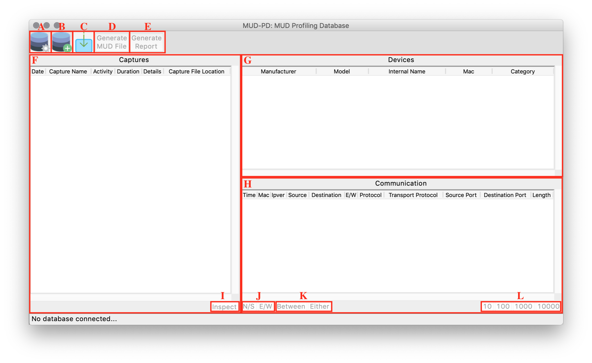
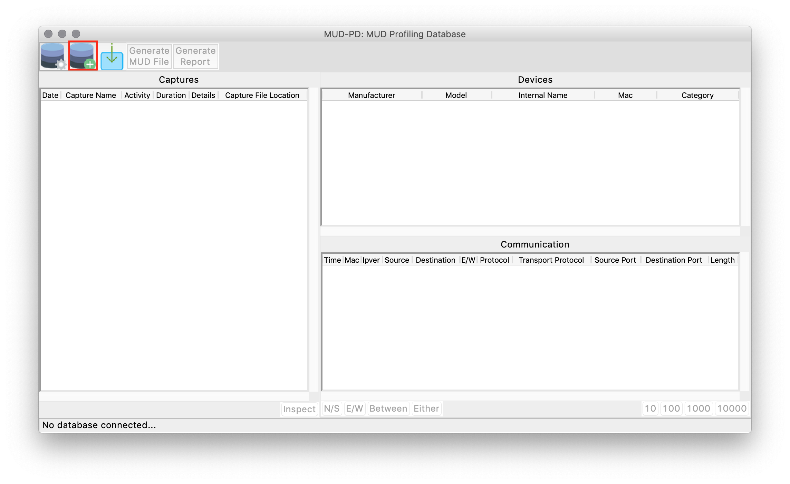
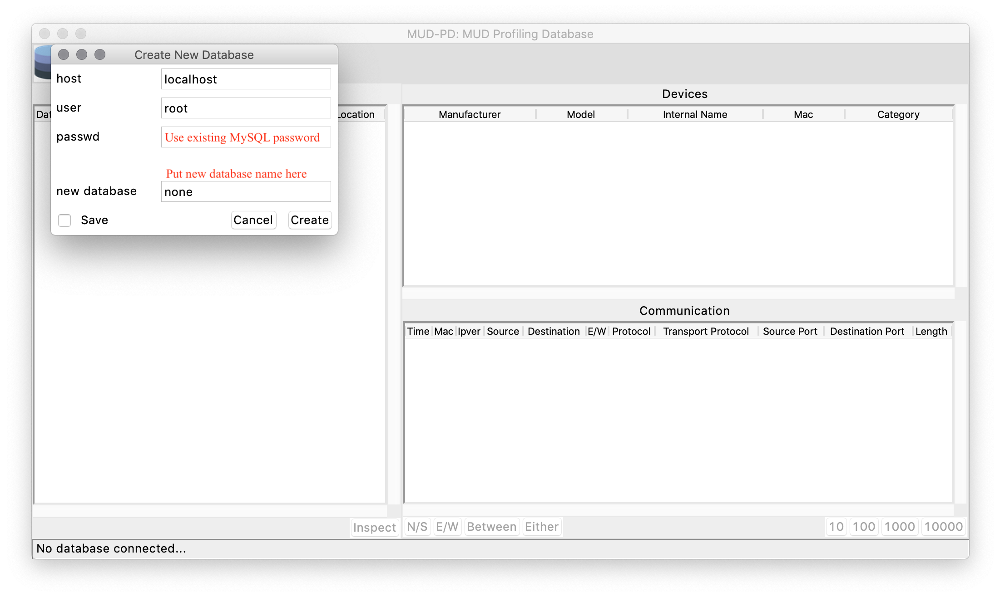
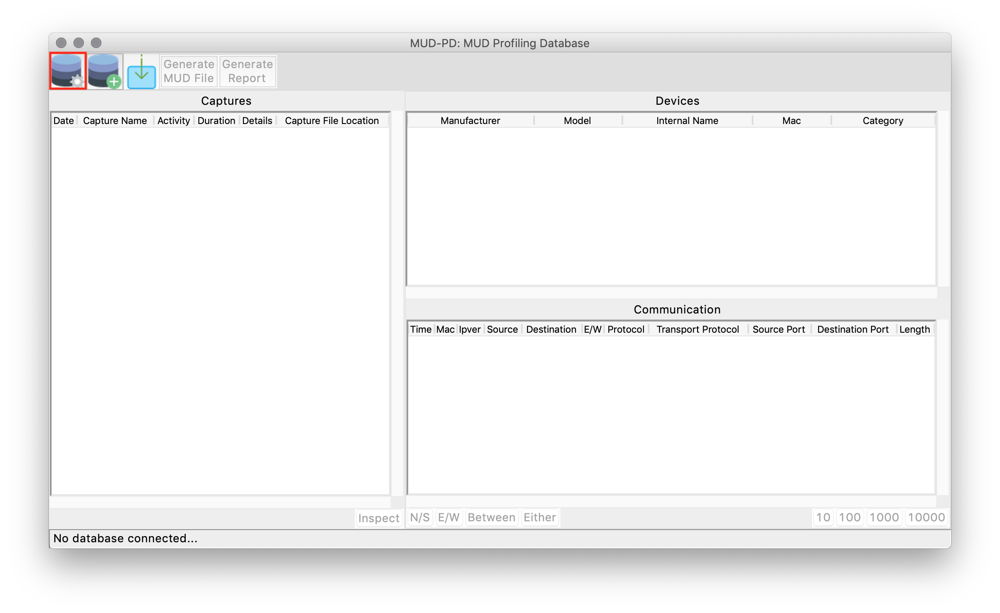
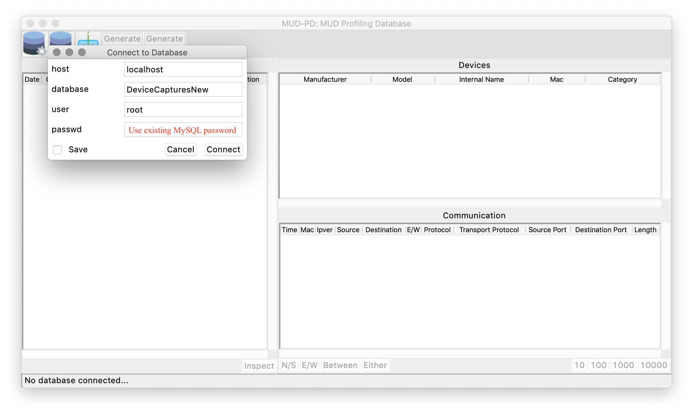
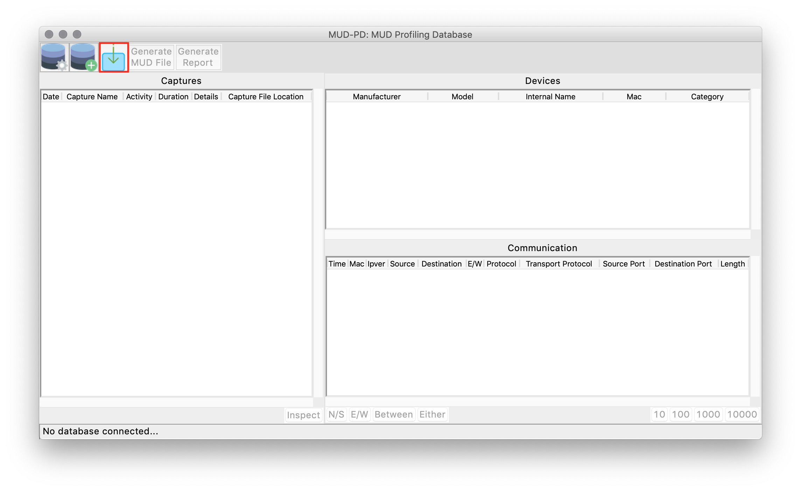

# MUD-PD

MUD-PD is designed to help internet of things (IoT) manufacturers, developers, and researchers to implement the
 Manufacturer Usage Description (MUD) specification.  MUD-PD is a tool assist in the characterization of IoT
  device network behavior and the creation and definition of appropriate MUD files.

For more information about the IETF MUD Specification: https://tools.ietf.org/html/rfc8520 

For more information about characterizing the network behavior of IoT devices see:
https://csrc.nist.gov/publications/detail/white-paper/2020/04/01/methodology-for-characterizing-network-behavior-of-iot-devices/draft

## NIST Disclaimers
Certain commercial products or company names are identified here to describe the experimental and computational
 procedure adequately. Such identification is not intended to imply recommendation or endorsement by the National
  Institute of Standards and Technology, nor is it intended to imply that the products or names identified are
   necessarily the best available for the purpose.

## NIST Software License
See LICENSE.TXT

## Key Updates
2021-03-12: Final planned feature push - PcapNg files now supported (read/write capture environment details from/to 
the comment field). MUD files are now generated through a newly designed wizard that requires "muddy" *see prerequisites

2020-07-24: Local caching of device details

2020-06-25: Fingerbank integration to assist in device identification

2020-06-25: Multiprocessing of PCAP files enabled (4+ threads recommended)

2019-10-22: Generation of human readable reports enabled

# Prerequisites and Use

MUD-PD has been built and tested on Apple (macOS 10.14) and Linux (Ubuntu 18+) computers.  MUD-PD is currently 
untested on Windows.

System specifications used for development and testing:

|             | macOS      | Linux (VM) |
|-------------|:----------:|:----------:|
| CPU         | 4th Gen i7 | 8th Gen i7 |
| CPU Threads | 8          | 4          |
| RAM         | 16 GB      | 6 GB       |

0. Git
     * macOS: easiest through an installer such as the one found at: https://www.atlassian.com/git/tutorials/install-git

     * Linux:
     ```sh
     shell> sudo apt-get install git
     ```
1. Python 3.7.2+

   * Check version
     ```sh
     shell> python3 --version
     ```
   * Instructions for updating/installing python3 can be found at: https://www.python.org/downloads/

     You can also try the following commands
     * macOS:
     ```sh
     shell> brew install python3
     ```

     * Linux
     ```sh
     shell> sudo apt-get install python3.7
     ```
     or
     ```sh
     shell> sudo apt-get install python3.8
     ```

2. MySQL
   1. MySQL Server

      Follow directions at: https://dev.mysql.com/downloads/mysql/

      Note: may need to create a new user and grant permissions using the following commands:
      ```sh
      shell> sudo mysql -u root -p
      mysql> CREATE USER '<new_user>'@'localhost' IDENTIFIED BY '<new_password>';
      mysql> GRANT ALL PRIVILEGES ON *.* TO '<new_user>'@'localhost';
      mysql> FLUSH PRIVILEGES;
      ```

   2. MySQL Workbench (optional)

      (recommended for those who may wish to interact directly with the database and write custom queries)

      Follow directions at: https://dev.mysql.com/downloads/workbench/    

3. pip (may already be installed)
   * macOS:
   ```sh
   shell> curl https://bootstrap.pypa.io/get-pip.py -o get-pip.py
   shell> python3 get-pip.py
   ```

   * Linux:
   ```sh
   shell> sudo apt-get install python3-pip
   ```

4. TkInter for Python3 (may already be installed)
   * macOS: instructions can be found at https://www.python.org/download/mac/tcltk/

   * Linux:
   ```sh
   shell> sudo apt-get install python3-tk
   ```

5. Wireshark (tshark) 3.4.4+
   
   Used to process and import packet captures. Can also be used to generate packet capture files
   * Download from: https://www.wireshark.org/download.html
   

6. Libpcap

   Used for generating packet captures to import into the database and tool 
   * Linux:
   ```sh
   shell> sudo apt-get install tcpdump
   ```
   * macOS: readily available by default
   * Windows: follow instructions at https://nmap.org/npcap/
    
## Installation

1. Install MUD-PD:
   ```sh
   shell> git clone https://github.com/usnistgov/MUD-PD.git
   shell> cd MUD-PD
   shell> pip3 install -r requirements.txt
   ```

2. Install muddy: (for MUD file generation)
   * Follow instructions at: https://github.com/upaulnight/muddy
   * IMPORTANT:
      * Latest verified compatible commit: c498ea9b159c5881ffbaacc2e4064c2cf9081775 (2021-03-12)
      * Verified to work when muddy is installed within the root directory of the MUD-PD repository

## Running MUD-PD
```sh
shell> python3 mudpd.py
```

## First Steps

   

   <ol type="A">
    <li>Connect to existing database</li>
    <li>Create and (re)initialize database</li>
    <li>Import capture file</li>
    <li>Generate MUD file</li>
    <li>Generate device report</li>
    <li>Box containing list of imported capture files</li>
    <li>Box containing list of local devices active on network during traffic captures</li>
    <li>Box containing list of communication within selected capture files</li>
    <li>Inspect selected imported capture file</li>
    <li>Toggle communication view to north/south (external), east/west (internal), or unfiltered traffic</li>
    <li>Filter communication to only that "between" selected devices or any packets to/from "either" device but not 
necessarily between both</li>
    <li>Limit list of packets in communication box to the selected number</li>
  </ol>

1. Create your first database:
   
   

   * Connect to existing database:
     
     

2. Import PCAP files:
   
   
## Troubleshooting

1. Update all packages and software are up-to-date:
   
    a. Run `shell> pip3 install -r requirements.txt`
   
    b. Verify that all prerequisite versions have been met (see "Prerequisites and Use" above)

    c. If the above steps don't solve the issue, please "Contact Us" (see below)

## Contact Us
These programs were developed by Paul Watrobski and Joshua Klosterman. Questions and bug reports may be directed to
 [Paul Watrobski](mailto:paul.watrobski@nist.gov?subject=[GitHub]%20MUD-PD). Please include the commit hash you are
  using as well as any code line numbers output in the terminal.

## These scripts should be cited as:
P. Watrobski, J. Klosterman, "MUD-PD", https://github/ustnistgov/MUD-PD

The commit hash and list of programs used should be included where applicable.

